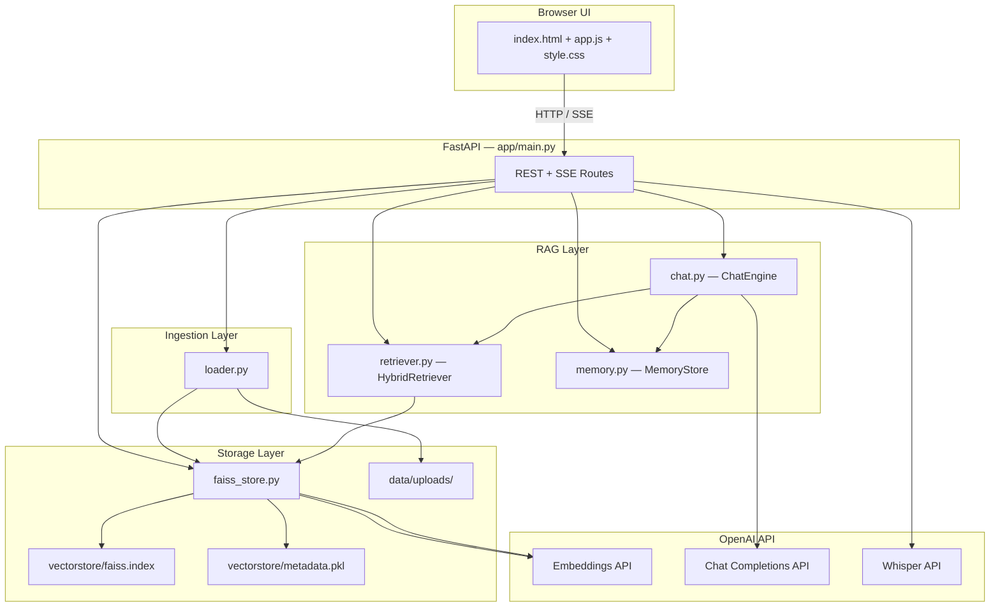
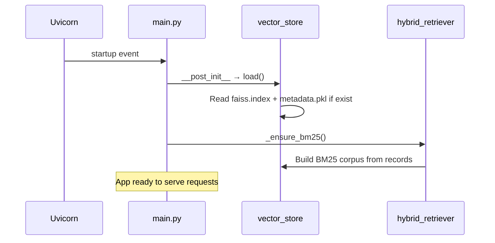
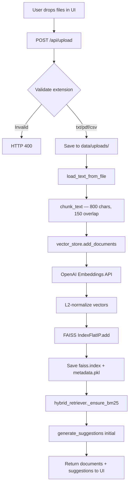
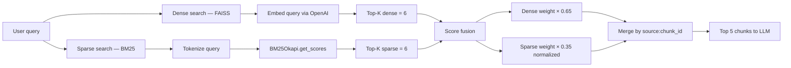
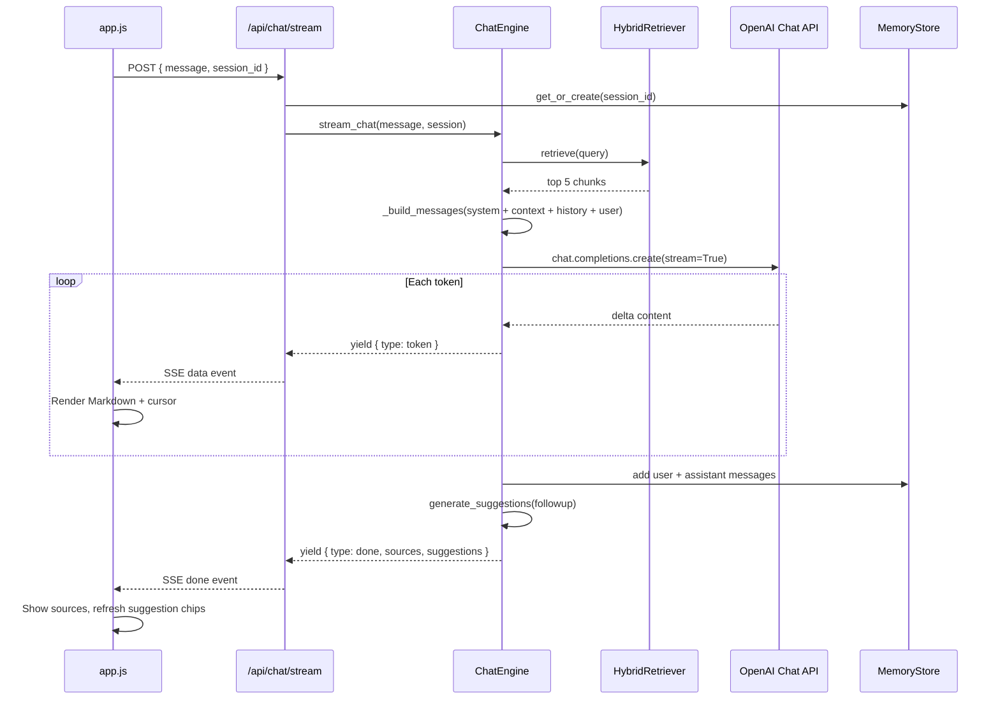
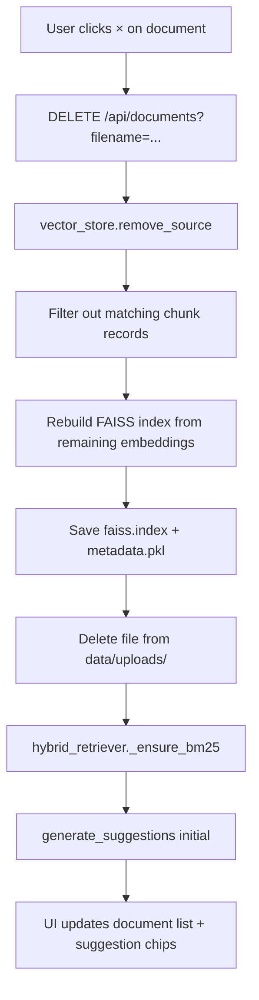
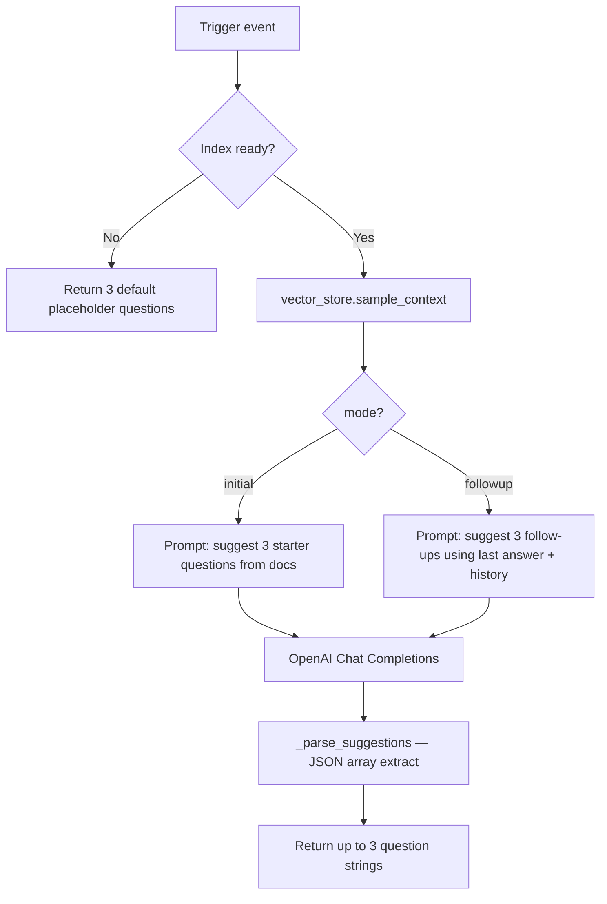
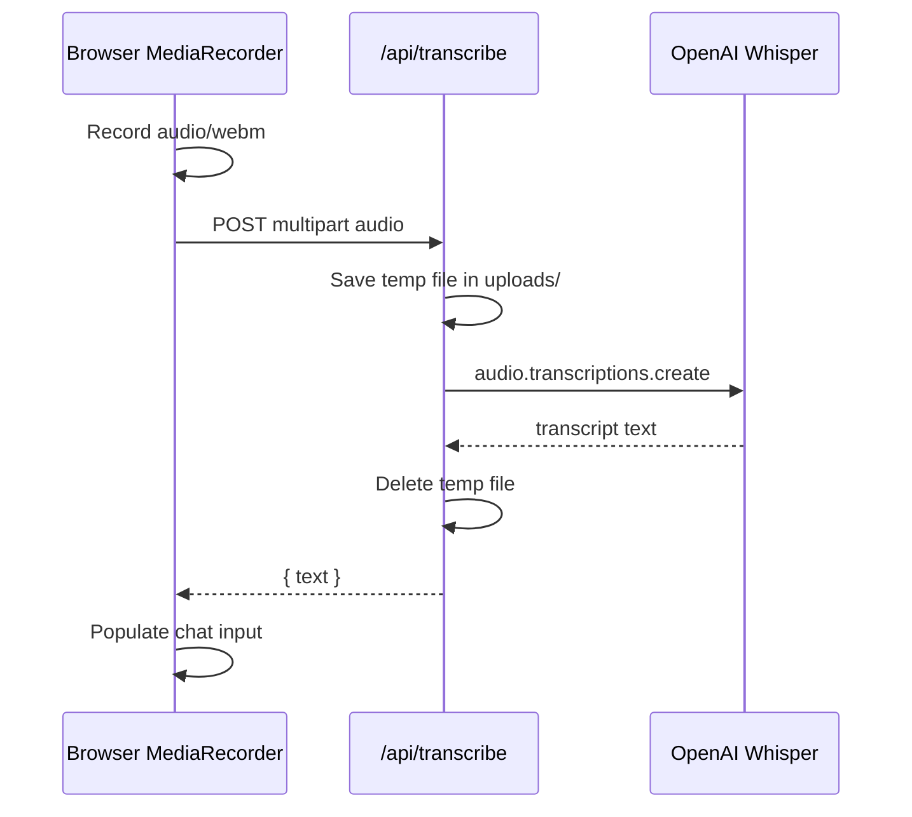

# Hybrid RAG Chatbot

A lightweight, local FastAPI application for document Q&A powered by **hybrid RAG** — combining FAISS dense vector search with BM25 keyword retrieval — plus OpenAI embeddings, streaming chat, conversational memory, and an interactive web UI.


---

## Table of Contents

- [Features](#features)
- [Architecture Overview](#architecture-overview)
- [Project Structure](#project-structure)
- [Setup & Installation](#setup--installation)
- [Configuration](#configuration)
- [Running the Application](#running-the-application)
- [Usage Guide](#usage-guide)
- [API Reference](#api-reference)
- [Detailed Code Flow](#detailed-code-flow)
- [Module Reference](#module-reference)
- [Data Persistence](#data-persistence)
- [Frontend Architecture](#frontend-architecture)
- [Troubleshooting](#troubleshooting)

---

## Features

| Category | Capability |
|----------|------------|
| **Ingestion** | Drag & drop or browse **TXT, PDF, CSV** (single or multiple files) |
| **Vector store** | FAISS index persisted to `vectorstore/faiss.index` + `vectorstore/metadata.pkl` |
| **Retrieval** | Hybrid RAG: semantic (FAISS) + keyword (BM25) with score fusion |
| **Chat** | Streaming SSE responses, Markdown rendering, source citations |
| **Memory** | Per-session conversation history for follow-up questions (last 20 turns) |
| **Suggestions** | 3 AI-generated starter questions after upload; 3 follow-ups after each answer; auto-refresh on document removal |
| **Voice** | Whisper speech-to-text (mic input) |
| **TTS** | Browser `speechSynthesis` to read answers aloud |
| **UI** | Dark / light mode, fixed viewport layout, scrollable document list |
| **Documents** | Per-file remove (× on hover), Clear All reset |

---

## Architecture Overview



**Request path summary:**

1. User uploads files → parsed, chunked, embedded → stored in FAISS.
2. User asks a question → hybrid retriever fetches relevant chunks → LLM generates a grounded answer with chat history.
3. Response streams to the browser via Server-Sent Events (SSE).

---

## Project Structure

```
Live RAG Project/
├── app/
│   ├── main.py                 # FastAPI app, routes, startup hooks
│   ├── config.py               # Environment variables & tunable constants
│   ├── ingest/
│   │   └── loader.py           # TXT/PDF/CSV parsing & text chunking
│   ├── storage/
│   │   └── faiss_store.py      # FAISS index, embeddings, persistence
│   ├── rag/
│   │   ├── retriever.py        # Hybrid dense + BM25 retrieval
│   │   ├── chat.py             # LLM chat, streaming, suggestions
│   │   └── memory.py           # Session-based conversation memory
│   └── static/
│       ├── index.html          # Single-page UI shell
│       ├── css/style.css       # Theming, layout, Markdown styles
│       └── js/app.js           # Upload, chat stream, voice, UI logic
├── data/
│   └── uploads/                # Raw uploaded files on disk
├── vectorstore/
│   ├── faiss.index             # FAISS vector index (binary)
│   └── metadata.pkl            # Chunk records + embedding matrix
├── .env                        # Secrets & model config (do not commit)
├── .env.example                # Template for environment variables
├── requirements.txt
├── venv/                       # Python virtual environment
└── README.md
```

---

## Setup & Installation

### 1. Create and activate virtual environment

**Windows (PowerShell):**

```powershell
cd "c:\BSP\Agent Studio\Live RAG Project"
python -m venv venv
.\venv\Scripts\Activate.ps1
```

**macOS / Linux:**

```bash
cd /path/to/Live\ RAG\ Project
python -m venv venv
source venv/bin/activate
```

### 2. Install dependencies

```powershell
pip install -r requirements.txt
```

### 3. Configure environment

Copy `.env.example` to `.env` (if needed) and set your OpenAI API key:

```env
OPENAI_API_KEY=sk-your-actual-key-here
OPENAI_EMBEDDING_MODEL=text-embedding-3-small
OPENAI_CHAT_MODEL=gpt-4o-mini
WHISPER_MODEL=whisper-1
```

---

## Configuration

All settings are loaded in `app/config.py` from `.env` and constants:

| Variable / Constant | Default | Description |
|---------------------|---------|-------------|
| `OPENAI_API_KEY` | — | Required for embeddings, chat, Whisper |
| `OPENAI_EMBEDDING_MODEL` | `text-embedding-3-small` | Embedding model for FAISS |
| `OPENAI_CHAT_MODEL` | `gpt-4o-mini` | Chat & suggestion generation |
| `WHISPER_MODEL` | `whisper-1` | Speech-to-text model |
| `CHUNK_SIZE` | `800` | Characters per text chunk |
| `CHUNK_OVERLAP` | `150` | Overlap between consecutive chunks |
| `TOP_K_DENSE` | `6` | FAISS candidates per query |
| `TOP_K_SPARSE` | `6` | BM25 candidates per query |
| `TOP_K_FINAL` | `5` | Chunks sent to the LLM after fusion |

---

## Running the Application

```powershell
uvicorn app.main:app --reload --host 127.0.0.1 --port 8000
```

Open **http://127.0.0.1:8000** in your browser.

Interactive API docs: **http://127.0.0.1:8000/docs**

---

## Usage Guide

1. **Upload documents** — Drag & drop or browse TXT / PDF / CSV in the Documents panel.
2. **Wait for indexing** — A progress indicator appears while chunks are embedded into FAISS.
3. **Ask questions** — Click a suggested chip or type in the chat input; answers stream in real time.
4. **Follow up** — Ask related questions; session memory keeps context across turns.
5. **Voice input** — Click the mic button; Whisper transcribes your speech into the input box.
6. **Read aloud** — Click the speaker button to hear the last answer (browser TTS).
7. **Remove a file** — Hover a document in the list and click **×**; suggestions refresh automatically.
8. **Clear All** — Resets uploads, FAISS index, and chat memory.
9. **Theme** — Toggle dark / light mode from the header.

---

## API Reference

| Method | Endpoint | Description |
|--------|----------|-------------|
| `GET` | `/` | Serve web UI |
| `GET` | `/api/status` | Index readiness, document list, chunk count |
| `POST` | `/api/upload` | Upload and embed one or more files |
| `POST` | `/api/chat` | Non-streaming chat (legacy) |
| `POST` | `/api/chat/stream` | **Streaming chat** via SSE |
| `POST` | `/api/suggestions` | Generate initial or follow-up question chips |
| `POST` | `/api/transcribe` | Whisper speech-to-text |
| `DELETE` | `/api/documents?filename=...` | Remove one indexed document |
| `DELETE` | `/api/clear` | Clear all documents, vectors, and memory |

### SSE event format (`/api/chat/stream`)

| Event type | Payload | When |
|------------|---------|------|
| `token` | `{ "type": "token", "content": "..." }` | Each streamed text delta |
| `done` | `{ "type": "done", "session_id", "sources", "suggestions" }` | Stream complete |
| `error` | `{ "type": "error", "message": "..." }` | Failure during stream |

---

## Detailed Code Flow

### 1. Application Startup



On import, `vector_store` (singleton in `faiss_store.py`) automatically loads any existing FAISS index from disk. The startup hook rebuilds the in-memory BM25 index to stay in sync.

---

### 2. Document Upload & Indexing



**Step-by-step (code path):**

1. **`app/main.py` → `upload_files()`** — Receives multipart file list.
2. **`app/ingest/loader.py` → `load_text_from_file()`** — Extracts plain text:
   - `.txt` — direct read
   - `.pdf` — `pypdf.PdfReader` page extraction
   - `.csv` — row-wise `column: value` text conversion
3. **`chunk_text()`** — Sliding window over normalized whitespace text.
4. **`app/storage/faiss_store.py` → `add_documents()`**:
   - Calls `embed_texts()` → OpenAI `embeddings.create`
   - Normalizes vectors with `faiss.normalize_L2`
   - Appends to `IndexFlatIP` (inner product = cosine similarity on unit vectors)
   - Persists index and metadata pickle
5. **`hybrid_retriever._ensure_bm25()`** — Rebuilds BM25 corpus from all chunk records.
6. **`chat_engine.generate_suggestions("initial")`** — LLM generates 3 starter questions from document samples.

---

### 3. Hybrid Retrieval



**Implementation (`app/rag/retriever.py`):**

- **Dense path** — `vector_store.dense_search()` embeds the query, searches FAISS, returns top 6 chunks with similarity scores.
- **Sparse path** — `sparse_search()` tokenizes the query, scores all chunks with BM25, returns top 6 with score > 0.
- **Fusion** — Chunks keyed by `{source}:{chunk_id}`. Dense score × 0.65; sparse score normalized to max then × 0.35. Overlapping chunks accumulate both scores.
- **Output** — Top 5 fused chunks passed to `ChatEngine._build_context()`.

---

### 4. Streaming Chat



**Prompt assembly (`app/rag/chat.py`):**

```
[System] RAG assistant instructions + Markdown formatting rules
[System] Document context (retrieved chunks) OR "no docs" notice
[History] Last 8 turns from session memory
[User]   Current question
```

The UI consumes SSE via `fetch()` + `ReadableStream`, parsing `data: {...}\n\n` frames. Markdown is rendered client-side with **marked.js**.

---

### 5. Document Removal



If the last document is removed, `vector_store.clear()` deletes the index files entirely and the index becomes empty (`ready: false`).

---

### 6. Question Suggestions



**Triggers:**

| Event | Mode | Where |
|-------|------|-------|
| Page load (if docs exist) | `initial` | `fetchStatus()` in `app.js` |
| After upload | `initial` | `upload_files()` response |
| After streamed chat completes | `followup` | SSE `done` event |
| After document removal | `initial` | `remove_document()` response |

---

### 7. Voice Transcription (Whisper)



---

## Module Reference

| Module | Responsibility |
|--------|----------------|
| `app/main.py` | HTTP routing, file I/O orchestration, SSE streaming wrapper |
| `app/config.py` | Paths, API keys, chunk/retrieval hyperparameters |
| `app/ingest/loader.py` | File parsing (TXT/PDF/CSV) and sliding-window chunking |
| `app/storage/faiss_store.py` | Embedding, FAISS CRUD, persistence, per-source removal |
| `app/rag/retriever.py` | BM25 index + hybrid score fusion |
| `app/rag/chat.py` | Context building, LLM calls, streaming, suggestion generation |
| `app/rag/memory.py` | In-memory session store (UUID per conversation) |
| `app/static/js/app.js` | UI state, upload, SSE chat, Markdown, voice, TTS |

---

## Data Persistence

```mermaid
erDiagram
    UPLOAD_FILE ||--o{ CHUNK_RECORD : produces
    CHUNK_RECORD ||--|| EMBEDDING_VECTOR : has
    FAISS_INDEX ||--|{ EMBEDDING_VECTOR : stores
    METADATA_PKL ||--|{ CHUNK_RECORD : stores
    METADATA_PKL ||--|{ EMBEDDING_VECTOR : stores

    UPLOAD_FILE {
        string filename
        path disk_path
    }
    CHUNK_RECORD {
        string text
        string source
        int chunk_id
    }
    EMBEDDING_VECTOR {
        float array normalized
    }
```

| Artifact | Location | Contents |
|----------|----------|----------|
| Raw files | `data/uploads/{filename}` | Original uploaded documents |
| FAISS index | `vectorstore/faiss.index` | Binary approximate nearest-neighbor index |
| Metadata | `vectorstore/metadata.pkl` | `{ records: ChunkRecord[], embeddings: ndarray }` |
| Sessions | In-memory only | Lost on server restart |

---

## Frontend Architecture

```mermaid
flowchart TB
    subgraph Layout["Fixed viewport — no page scroll"]
        Header[Topbar — theme, clear]
        Docs[Documents panel]
        Chat[Chat panel]
    end

    subgraph DocsPanel
        Drop[Drop zone]
        List[Scrollable document list]
        Progress[Upload progress]
    end

    subgraph ChatPanel
        Messages[Scrollable chat messages]
        Suggestions[Suggestion chips]
        Input[Mic + text + TTS + send]
    end

    Docs --> DocsPanel
    Chat --> ChatPanel
    Messages --> Markdown[marked.js rendering]
    Input --> Stream[SSE /api/chat/stream]
    Input --> Whisper[/api/transcribe]
```

**Key UI behaviors:**

- Document list scrolls internally when many files are indexed.
- Chat messages scroll independently inside the chat panel.
- Assistant replies support live Markdown rendering during streaming.
- Suggestion chips are disabled while a stream is in progress.

---

## Troubleshooting

| Issue | Cause | Fix |
|-------|-------|-----|
| `[WinError 10013]` on startup | Port 8000 already in use | `netstat -ano \| findstr :8000` then `Stop-Process -Id <PID> -Force` |
| Empty answers | Missing/invalid API key | Set `OPENAI_API_KEY` in `.env` |
| No document context | Index empty or wrong files | Upload supported formats (TXT, PDF, CSV) |
| Mic not working | Browser permission denied | Allow microphone access in browser settings |
| Raw `**bold**` in chat | Cached old JS | Hard refresh: `Ctrl+Shift+R` |

---

## Requirements

- **Python** 3.10+
- **OpenAI API key** (embeddings, chat completions, Whisper)
- **Modern browser** with ES6+, `fetch`, `ReadableStream`, and microphone access (optional)

---

## Security Notes

- Never commit `.env` or expose your OpenAI API key.
- Uploaded files are stored locally under `data/uploads/`.
- Session memory is held in process memory only — not persisted to disk.
